# 微信小程序第4课解题秘籍

### 一，项目导入

“12-美食收藏” 导入Hbuilder

“12-美食收藏-云开发”导入微信开发者工具

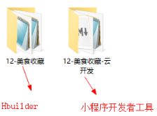

### 二，配置uni-app

#### 1.uniapp appid

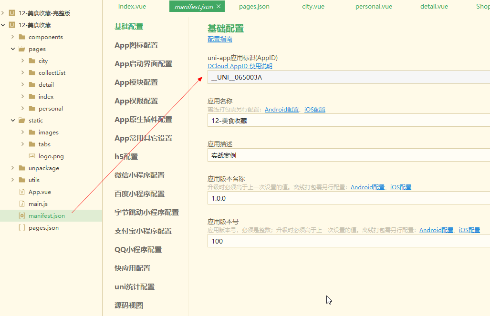

#### 2.微信小程序appid

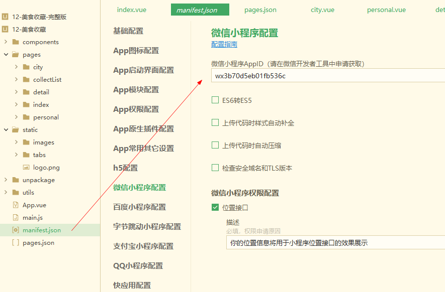

#### 3.微信开发者工具路径

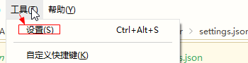

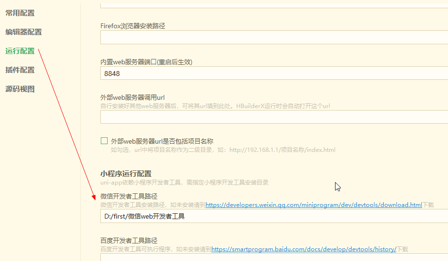

#### 4.不校验合法域名

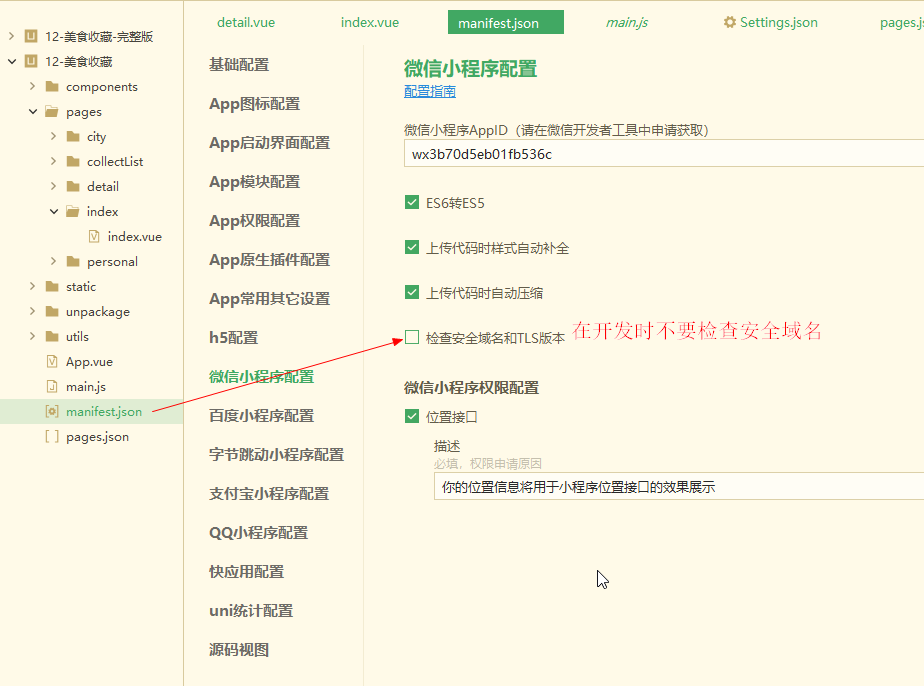

### 二，云开发配置

#### 1.建立云环境

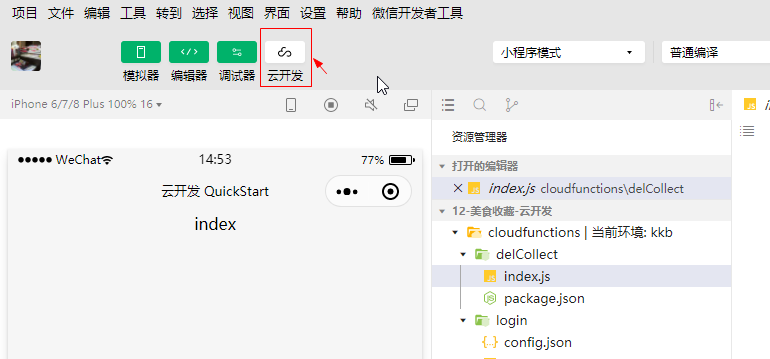

#### 2.在云开发平台的数据库中建立favorList 和collect集合

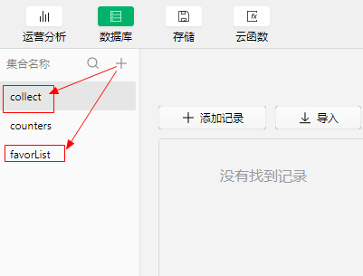

#### 3.在favorList 集合中导入favorList.json 数据

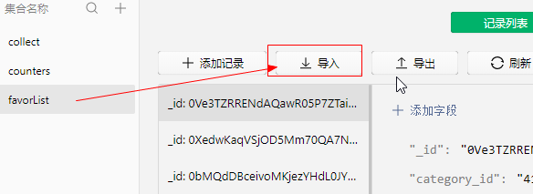

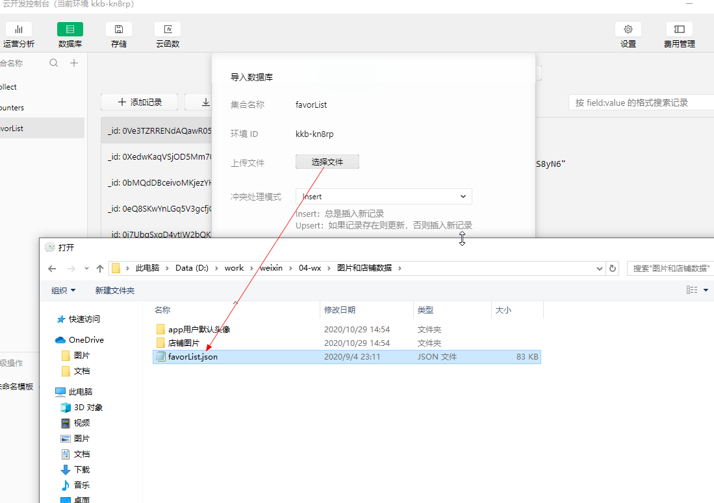

设置数据权限

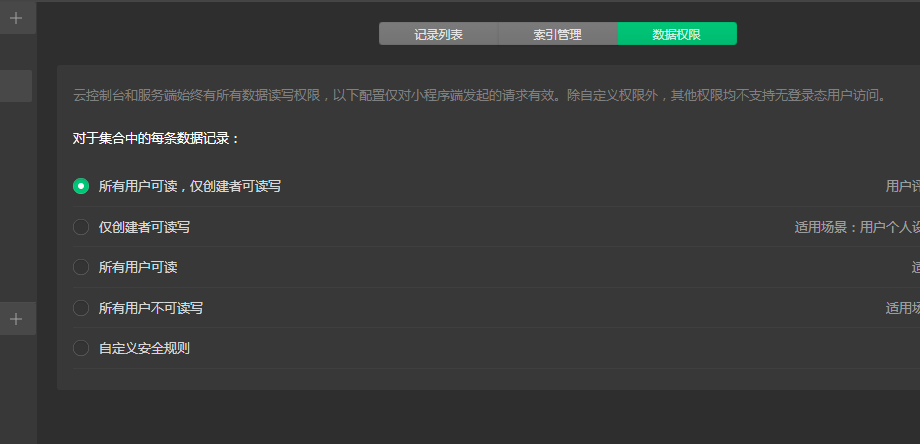

#### 4.在云存储上传图片资源

在云存储中建立项目目录mdata

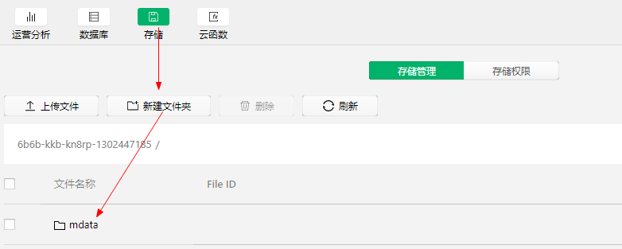

进入mdata 目录建立app和img文件

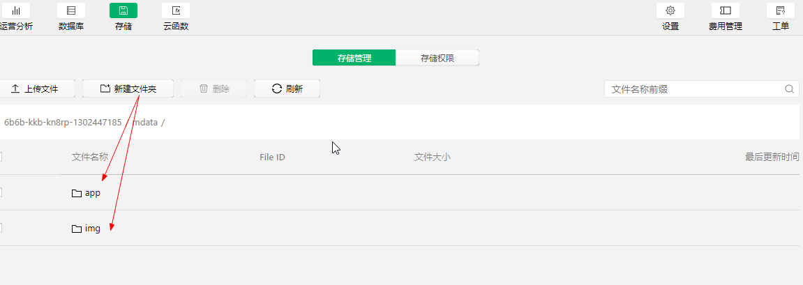

在img 目录中上传图片文件

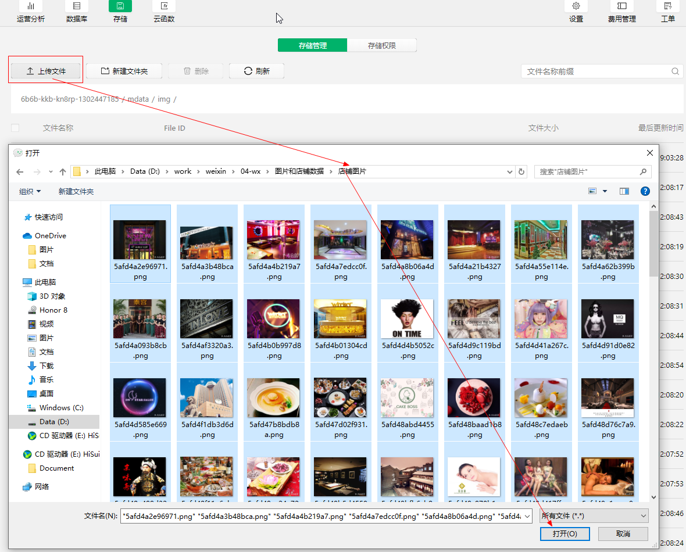

再app 目录中上传默认用户头像

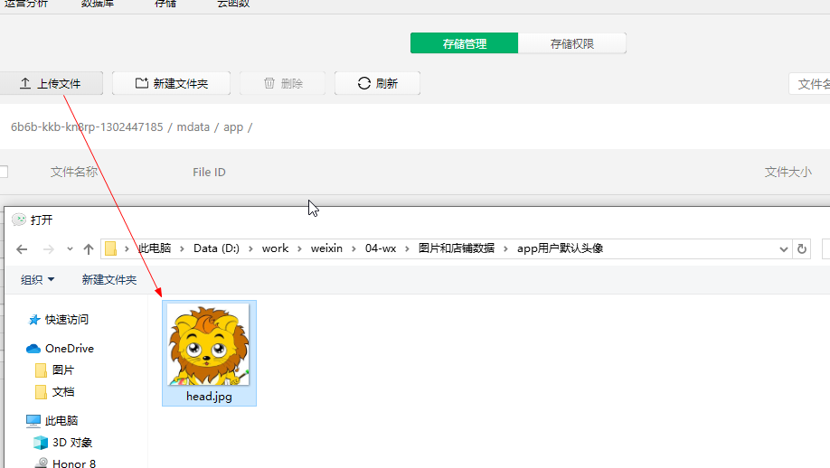

#### 5.把我的云函数部署到云端。

大家可以直接建立一个自己的云开发项目，云开发项目要使用自己的环境

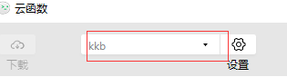

把我“12-美食收藏-云开发” 里的两个云函数复制粘贴到自己的项目里。

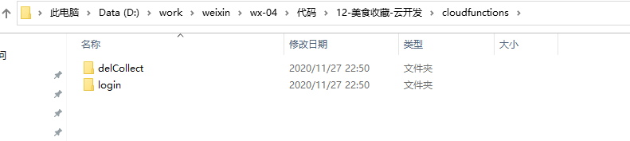

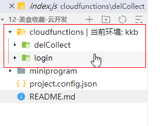

把两个云函数上传并部署到云端

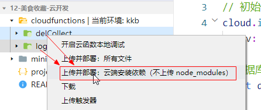

效果如下：

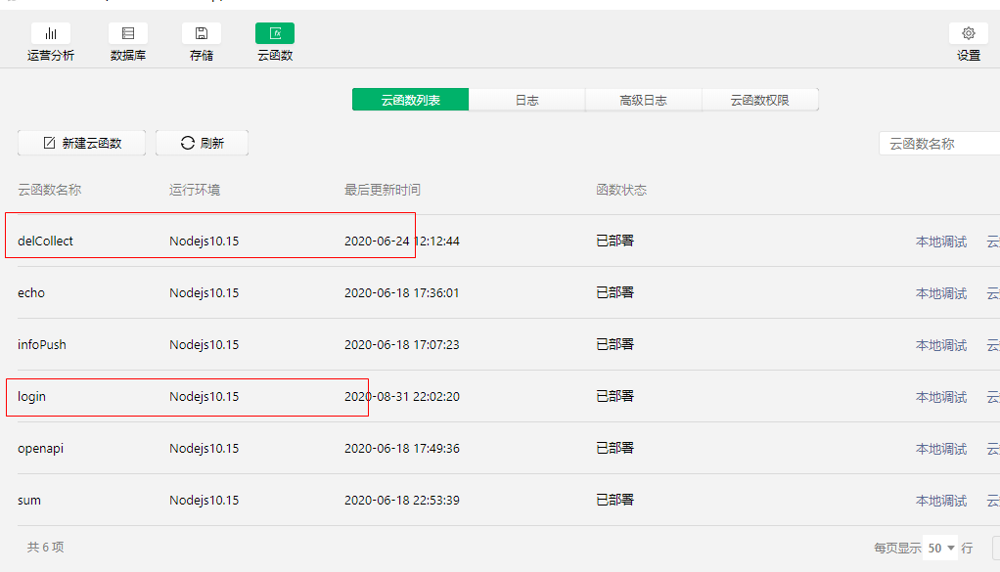

### 三，配置uniapp 中的配置

#### 1.app.vue 里初始化环境id。

kkb-kn8rp要改成大家自己的云开发环境id。注意：是云开发环境id，不是appid

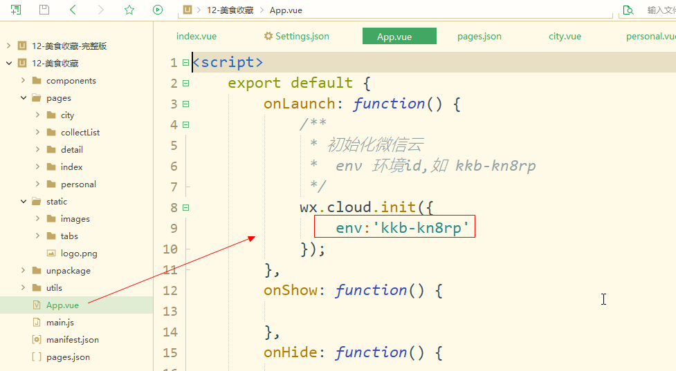

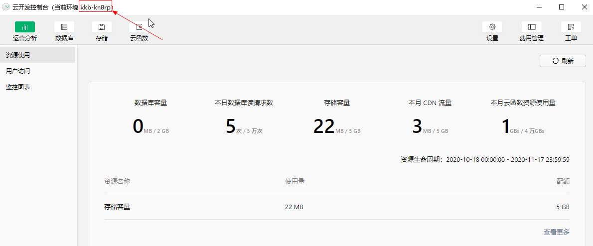

#### 2-创建QQ地图的秘钥

地址： https://lbs.qq.com/dev/console/key/manage 

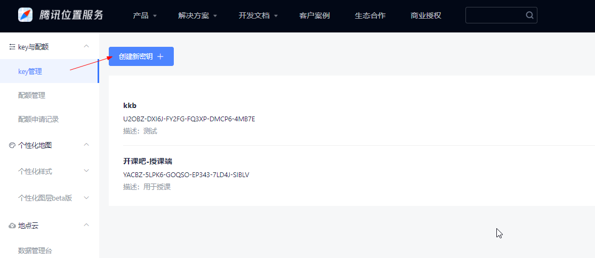

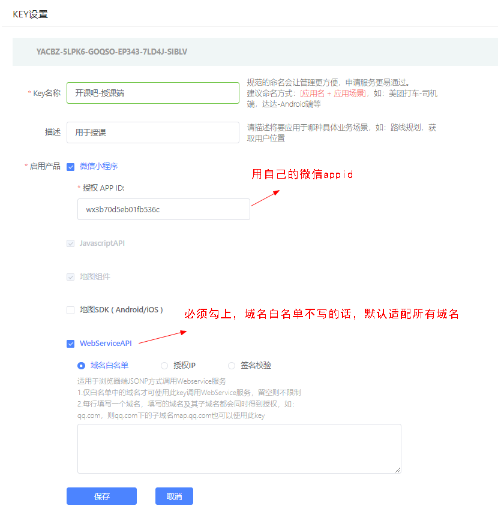

这就是QQ地图的秘钥：

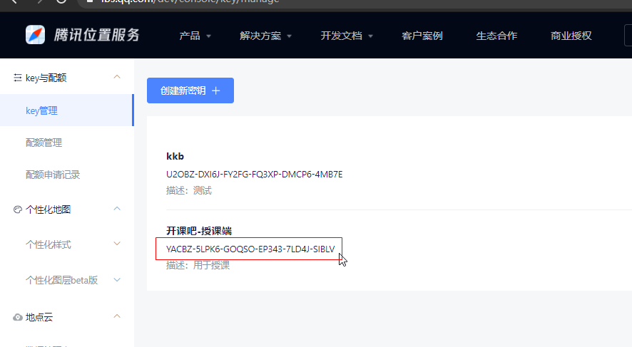

#### 3.在实例化QQ地图时，写入QQ地图的秘钥

#### 4.ShopList 里的图片路径要写自己的

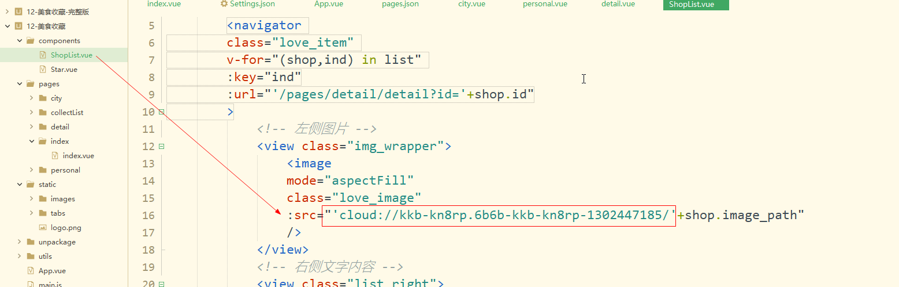

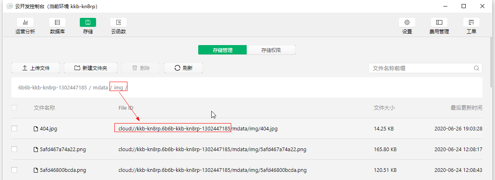

其它用到云端图片的地方也是同样道理。